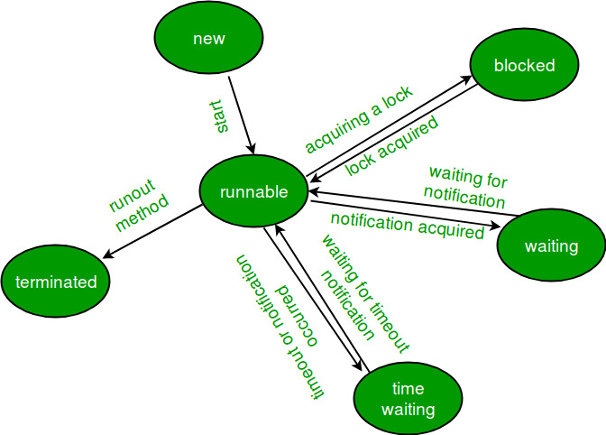
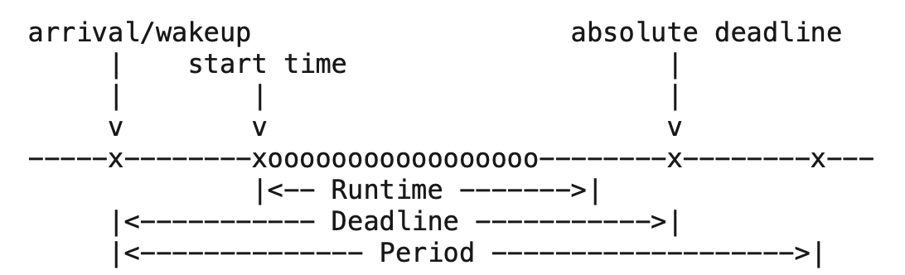

# 调度

自动驾驶功能由传感器、融合感知、预测、决策规划、控制和可视化等多个模块协同实现。多个模块无论是以多个进程，还是以一个进程内的多个线程的形式运行，自动驾驶系统应当具有调度这些进程和线程的能力，保障高优先级任务能够优先运行，避免在资源有限的情况下出现低优先级任务与高优先级任务争夺资源的情况。

根据粒度的不同，调度主要分为进程调度和任务调度。

## 进程调度

进程调度主要依赖于操作系统的能力。Linux操作系统支持一些基本的调度策略，包括实时调度策略`SCHED_FIFO`和`SCHED_RR`，以及非实时调度策略`SCHED_OTHER`（即当前内核版本的CFS调度策略），部分内核也支持“硬实时”调度策略`SCHED_DEADLINE`。

通过选择不同的调度策略，并搭配进程调度优先级的设置，我们可以让一些进程的任务被优先执行，实现调度的目的。

### 进程的状态


### 进程调度优先级
进程可以被设置为普通进程或者实时进程。进程的优先级主要有静态优先级（static priority）和动态优先级（dynamic priority）。

**静态优先级**：在`sched_attr`中为`sched_priority`字段。对于普通进程，静态优先级为0；对于实时进程，静态优先级为1-99，99为最高优先级。调度策略仅会影响相同静态优先级的进程的执行顺序。

**动态优先级**：仅对普通进程有用，取决于nice和一个动态调整的量（比如进程ready却没被调度，则增加）。

### 调度策略策略
`SCHED_FIFO`
即先进先出，是一种实时调度策略。选择`SCHED_FIFO`策略的进程不会分时间片，一旦开始调度，就调度至结束，除非被其他更高优先级进程插入。相同优先级的任务会按照派发的顺序依次加入调度队列，并按入队顺序先后执行，一次调度完成后，回到该优先级队列的末尾。优先级更高的任务会中断正在执行的低优先级任务而率先执行。只有所有的高优先级的任务都执行完成，才会执行低优先级的任务。


`SCHED_RR`
即Round-Robin，也是一种实时调度的策略。FIFO调度方式容易导致进程长时间占据CPU而阻塞了其他同样重要的进程的调度。相比于FIFO策略，RR添加了一个时间片的概念：相同优先级的任务会依次被执行一定时间片，时间片结束后，如果任务还未完成，会被放到该优先级的任务队列的队尾等待下次调度。

`SCHED_OTHER`
是普通进程的调度策略，也被命名为`SCHED_NORMAL`。现在的内核版本（2.6.23以后）执行的是完全公平调度（CFS，Completely Fair Scheduling），旧的内核版本曾经是用过“O（1）”调度。

`SCHED_DEADLINE`
是一种在更近期的内核中（3.14以后）提供的实时调度策略。其中有几个重要的时间概念：arrival time，start time，absolute deadline，relative deadline，period（如下图所示）。其中用户申请一个进程为DEADLINE策略的时候，需要指定Deadline（即relative deadline）、Period（即period）和Runtime。通常Runtime会被指定为一个大于平均运行时间的数，或者被指定为最坏运行时间。

以`SCHED_DEADLINE`策略进行调度的进程不存在优先级，调度时不会被中断，确定执行。在设置的时候，会有可行性检查（admission test），如果Kernal认为不可行，会拒绝。



除了以上几种常见策略之外，还有`SCHED_BATCH`、`SCHED_IDLE`等调度策略。


### 调度策略设置
进程（线程）可以通过系统调用设置自身或者其他进程（线程）的调度策略。
- 设置调度策略和参数：
```cpp
#include <sched.h>
int sched_setattr(pid_t pid, struct sched_attr *attr,
                  unsigned int flags);
int sched_getattr(pid_t pid, struct sched_attr *attr,
                  unsigned int size, unsigned int flags);
```
其中`pid`为0时，设置自身的调度策略和参数。结构体`sched_attr`包含以下字段：`size`、`sched_policy`（即调度策略，具体会在下一节介绍）、`sched_flags`、`sched_nice`、`sched_runtime`、`sched_deadline`、`sched_period`（最后三个为`SCHED_DEADLINE`相关的参数）。当设置成功，系统调用返回0；否则返回-1，并会设置`errno`。
- 设置CPU亲和性
```cpp
int sched_setaffinity(pid_t pid, size_t cpusetsize,
                      cpu_set_t mask);
int sched_getaffinity(pid_t pid, size_t cpusetsize,
                      cpu_set_t mask);
```

### 软实时与硬实时

TBD

## 任务调度

在这里，任务被解释为一个函数的执行。任务调度本身有多种含义，比如说当我们各个模块都是一个进程，每个进程何时执行任务可以算做任务调度的范畴，基于此有事件触发和timer触发两种策略。而对于一个进程内的，由事件触发或者timer触发的各个任务，决定具体执行的顺序或者时间也是任务调度的工作。

在C++实现上，一个最小粒度的任务可以被包裹为一个`std::packaged_task<T>`，通过`get_future`获取一个异步的返回值。一个复杂的任务可以被抽象为一些单个任务的集合，并需要按照某个有向无环图定义的顺序来运行。针对此，有一些开源的框架帮助我们实现此类任务的调度，比如`task_flow`。

## 参考
1. [Lifecycle and States of a Thread in Java - Geeksforgeeks](https://www.geeksforgeeks.org/lifecycle-and-states-of-a-thread-in-java/)

2. [sched - Linux Manual](https://www.man7.org/linux/man-pages/man7/sched.7.html)

3. [taskflow - Github](https://github.com/taskflow/taskflow)