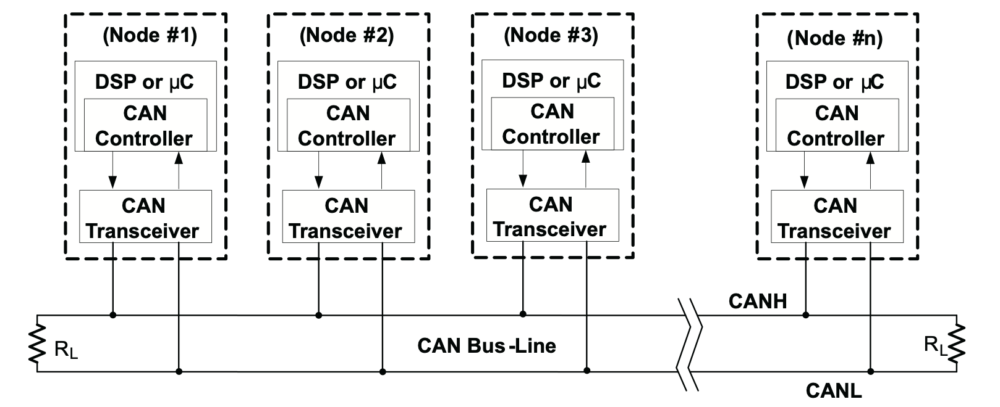
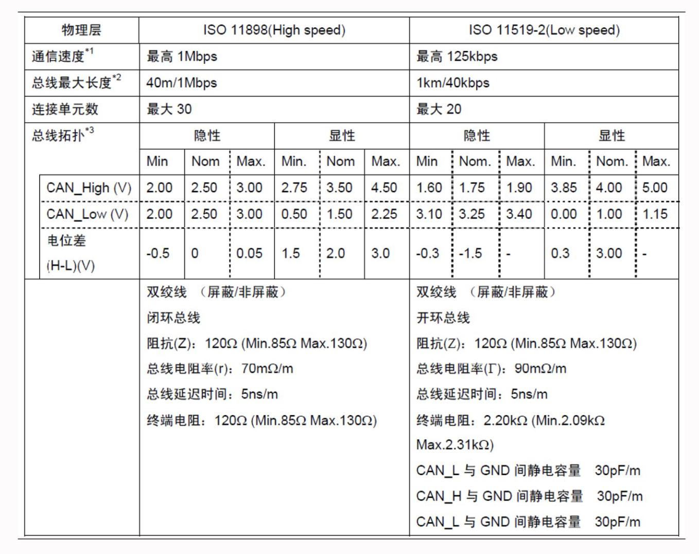

# CAN总线

## 概述
* CAN的全称是Controller Area Network。最早由博世公司提出，是广泛应用于车身ECU间通信的一个总线协议。

  

* CAN总线上的通信为**分布式**的**广播**形式的通信，每一个通信的参与者都能广播给其他的参与者。

* 物理上，CAN总线是**双绞线**，分为**CAN高和CAN低**。每个节点都有**CAN收发器**和**CAN控制器**，作用如下：
  > CAN控制器用于将欲收发的消息（报文），转换为符合CAN规范的CAN帧，通过CAN收发器，在CAN-bus上交换信息。

  > CAN收发器是CAN控制器和物理总线之间的接口，将CAN控制器的逻辑电平转换为CAN总线的差分电平，在两条有差分电压的总线电缆上传输数据。

  

* **CAN报文**采用的是短帧结构，每一帧的有效字节数是8个。报文的种类主要有：数据帧、远程帧、错误帧、超载帧、帧间隔。

  

* **波特率**

* **同步机制**


* **仲裁机制**

* **高速CAN和低速CAN**是两个不同的物理层协议，主要区别如下：
  


## SocketCAN
在Linux上，SocketCAN提供了一套协议，让我们可以通过socket来控制CAN控制器来进行CAN总线上的通信。
> A device driver for CAN controller hardware registers itself with the Linux network layer as a network device, so that CAN frames from the controller can be passed up to the network layer and on to the CAN protocol family module and also vice-versa. 

为了更好地应用SocketCAN，可以使用**can-uitls**工具包。这个工具包中提供了candump、canplayer、cansend、cangen等基本工具，可以实现存储CAN报文、播放CAN报文记录、发送CAN数据、生成CAN数据等功能，用于调试。例如：

```
modprobe vcan                              # 载入vcan内核模块
ip link add dev vcan0 type vcan            # 添加vcan类型的虚拟设备vcan0
ip link set up vcan0                       # 改变设备vcan0的状态为UP
canplayer -I some_data.candump vcan0=can0  # 播放candump文件，将can0收到的播放至vcan0
```

## CANoe（CAN Open Environment）

德国Vector公司开发的CAN开发和调试工具。
> CANoe is the comprehensive software tool for development, test and analysis of individual ECUs and entire ECU networks. It supports network designers, development and test engineers throughout the entire development process – from planning to system-level test.

## CAN数据矩阵

数据链路上的CAN报文数据是人类不可读的，需要通过一个转换关系才能转换为有物理意义的数值。这个转换关系就定义在CAN数据矩阵里，数据矩阵定义了特定CAN ID的报文中不同字段的起始位置、长度、偏移量、缩放系数等关键信息。工业上，常常使用**DBC**（CAN Database）来作为CAN数据矩阵的标准文件格式。一些功能能够支持通过DBC文件生成对应的转换代码帮助我们解析、生成CAN报文。


## 实际应用

在自动驾驶应用中，需要用到CAN总线来实现自动驾驶系统与其它ECU/MCU之间的通信，比如接收车身状态信号（车速信息、加速度信息、车门状态、车灯状态），发送车辆控制信号（油门、刹车、方向盘）等。

常常会使用供应商提供的解决方案，比如使用Dataspeed、Kvaser等公司的硬件和封装的驱动来实现CAN报文的收发。

## 其它车载总线

LIN总线
> LIN bus is a lower cost supplement to CAN bus networks, with less harness and cheaper nodes. LIN bus clusters typically consist of a LIN master acting as gateway and up to 16 slave nodes. Typical use cases include e.g. non-critical vehicle functions like aircondition, door functionality etc.

车载以太网
> This is increasingly being rolled out in the automotive sector to support the high bandwidth requirements of ADAS (Advanced Driver Assistance Systems), infotainment systems, cameras etc. Automotive ethernet offers much higher data transfer rates vs. CAN bus, but lacks some of the safety/performance features of Classical CAN and CAN FD. Most likely, the coming years will see both automotive ethernet, CAN FD and CAN XL being used in new automotive and industrial development

## 参考

1. [CAN Bus Explained](https://www.csselectronics.com/screen/page/simple-intro-to-can-bus/language/en)

2. [Introduction to the CAN - TI](https://www.ti.com/lit/an/sloa101b/sloa101b.pdf)

3. [CAN控制器和收发器 - 知乎](https://zhuanlan.zhihu.com/p/151073146)

4. [高速CAN和低速CAN的区别 - 知乎](https://zhuanlan.zhihu.com/p/33212308)

5. [SocketCAN](https://www.kernel.org/doc/html/v4.17/networking/can.html)